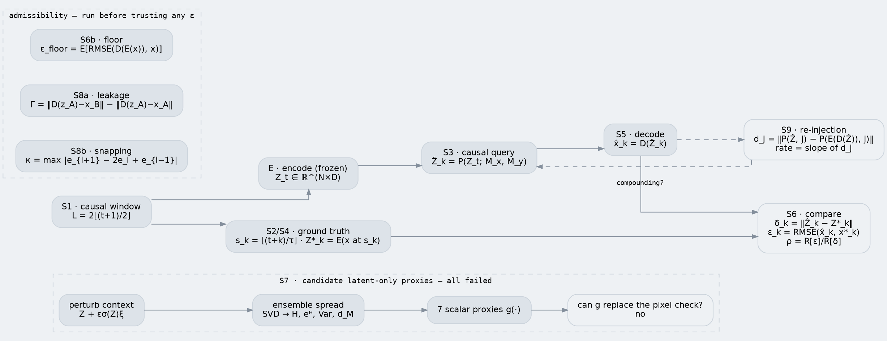
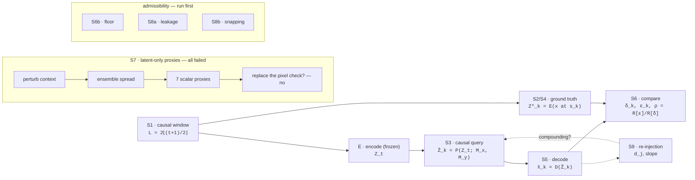

# System-design drawing — prompts and sources

Three ways to get the Horizon Ladder system diagram as an image. Pick by what you need.

1. **`prompt-a`** — paste into GPT-5 / GPT-4o image generation (or Nano Banana, Midjourney, Ideogram)
   for a polished, presentation-style figure.
2. **`prompt-b`** — a shorter, punchier variant for a slide or a paper teaser.
3. **Graphviz / Mermaid source** — deterministic, correct text. Use this when the labels must be
   exactly right; image models mangle subscripts, hats and Greek letters almost every time.

> The authoritative version is the inline SVG in `outputs/math.html` — it is already vector, theme-aware,
> and its labels are guaranteed correct. The prompts below are for when you want an *illustrated* figure
> rather than a schematic.

---

## prompt-a — full system diagram

```
Create a clean, technical system-architecture diagram for a machine-learning
research protocol called "Horizon Ladder". Flat vector illustration style,
no 3D, no gradients, no drop shadows, no clip art, no people. Thin 1.5px
rounded-rectangle boxes with generous whitespace, a single accent colour
(deep blue) used sparingly, everything else in near-black on a very light
warm-grey background. Typography: a clean grotesque sans for box titles,
a monospace face for the small formula lines under each title. Left-to-right
reading order. 16:9 landscape.

The diagram has one main horizontal chain across the middle, one branch
below it, one feedback loop, and two labelled dashed enclosures.

MAIN CHAIN, left to right, five boxes joined by solid arrows:
1. "Causal window" — subtitle "past frames only, x[0:L]". Show a small
   filmstrip icon of 4 video frames, the last one highlighted.
2. "Encoder E (frozen)" — subtitle "Z_t, token sequence". Draw a small
   snowflake glyph in the corner to mean frozen.
3. "Predictor P (frozen)" — subtitle "masked causal query, horizon k".
   Mark this box with a small warning tag reading "out of distribution".
4. "Minimal decoder D" — subtitle "one linear layer per token".
   Mark it with a small tag reading "deliberately weak".
5. "Compare" — a wider box listing three short lines:
   "latent drift", "pixel error", "excess over floor".

BRANCH BELOW THE CHAIN:
A wide box labelled "Ground truth at the target frame", subtitle
"the future frame the rollout claims to predict". A solid arrow goes from
box 1 down into it, and another solid arrow goes from it up into box 5.
Draw a single real video frame thumbnail inside this box.

DASHED ENCLOSURE, lower left, labelled "ADMISSIBILITY — run before trusting
any pixel number". It contains three small boxes:
- "Decoder floor" — subtitle "reconstruction error on real frames"
- "Context leakage check" — subtitle "does the decoder read its input?"
- "Snapping check" — subtitle "smooth interpolation, no jumps"

FEEDBACK LOOP, lower right: a box labelled "Re-injection divergence",
subtitle "decode, re-encode, resume the rollout". A dashed arrow runs down
from box 4 into it, and a small curved dashed arrow loops from it back up
toward box 3 to show the compounding test.

TOP STRIP, spanning the full width, inside its own dashed enclosure
labelled "CANDIDATE LATENT-ONLY PROXIES — tested, all failed":
four small boxes joined by arrows — "perturb the context", "ensemble
spread", "7 scalar proxies", and a final box "can a proxy replace the
pixel check?" with a red cross mark and the caption "no".

Keep every label short and legible. Do not invent additional boxes,
equations, axes or logos.
```

## prompt-b — one-slide teaser

```
Minimal flat vector diagram, 16:9, light warm-grey background, one deep-blue
accent, thin rounded boxes, clean sans + monospace labels, lots of whitespace.

A left-to-right pipeline of four boxes: "past frames" -> "frozen encoder" ->
"frozen predictor (queried out of distribution)" -> "deliberately weak
decoder". The fourth box outputs into a "compare" box that sits beside a
second, lower box labelled "real future frame", with both feeding the same
comparison.

Above the pipeline, a faded strip of small boxes labelled "cheap latent-only
shortcuts" ending in a red cross and the word "no".

Below the pipeline, a dashed frame labelled "checks that must pass first"
containing three tiny boxes: "decoder floor", "leakage", "snapping".

One dashed feedback arrow from the decoder back into the predictor labelled
"re-injection".

No people, no 3D, no logos, no extra text.
```

**Expect to iterate.** Image models mis-render subscripts and hats. Two things that help:
ask for "short labels only, no mathematical notation" (as above), then add the equations yourself;
or generate the figure, then overlay the real formulas from `outputs/math.html`.

---

## Graphviz DOT — exact labels, no model needed

```bash
dot -Tsvg outputs/system_diagram.dot -o outputs/system_diagram.svg
```



## Mermaid — for a README or a wiki


